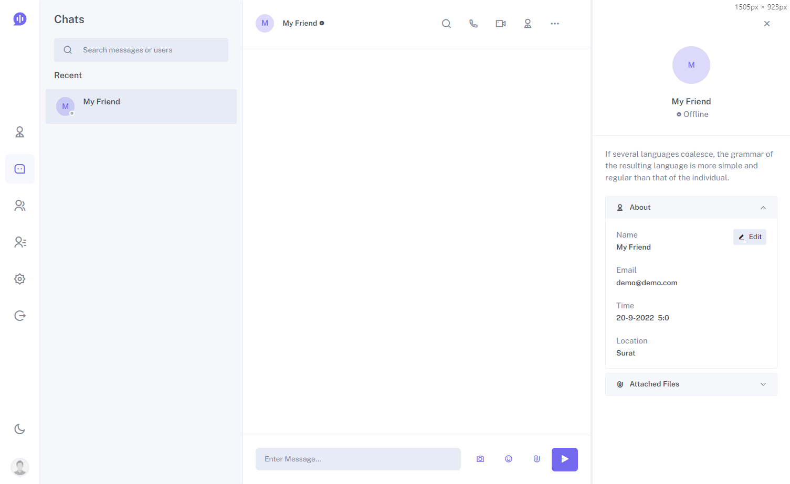
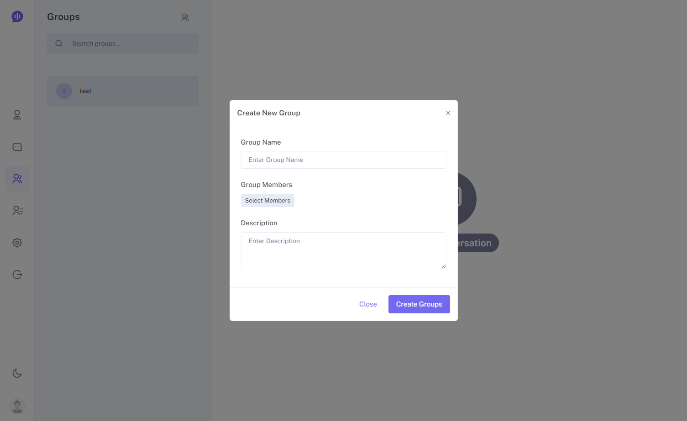
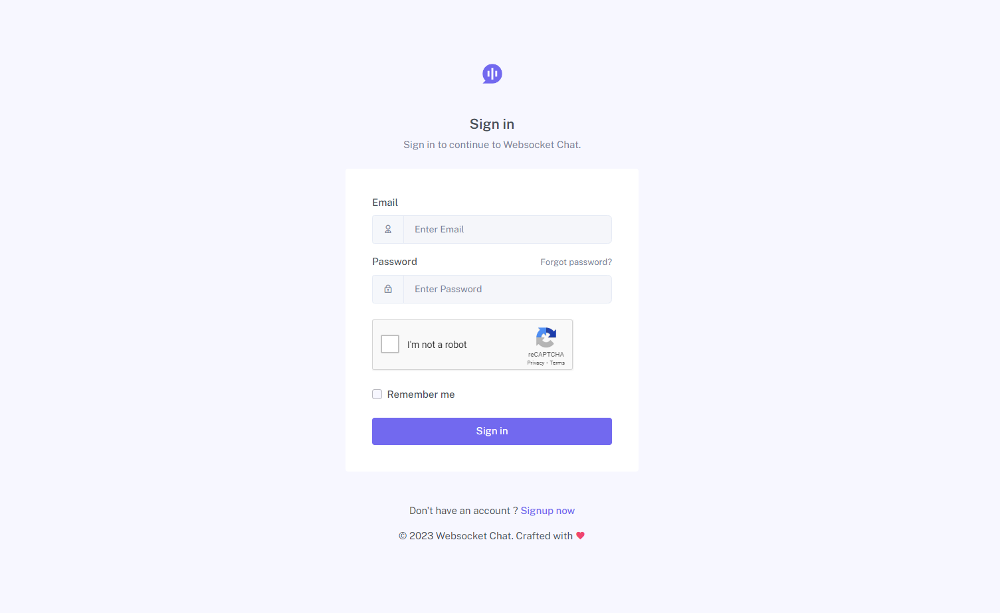

# Websocket Chat

Application is a feature-rich static chat app built using Bootstrap ^5.3.0-alpha2 and React JS, along with SCSS to ensure responsiveness across all devices. The app supports Dark, Light, and RTL modes for a customizable user experience. It includes both functional and class-based components, and we have integrated Redux-Saga for authentication purposes. However, please note that this template does not incorporate any database-related or file-saving functionalities; the chat data is managed solely through a JSON object.

The app boasts a plethora of functionalities, including one-to-one and group chat, a contact list, file sharing, online user tracking, and message read/unread status. We have also included authentication pages to enhance security. Additionally, our app offers multi-language support through an i18n JSON object, making it accessible to a wider audience.

### FEATURES:

* Built with Bootstrap ^5.3.0-alpha2
* React Redux – Redux-Saga – React Hooks based architecture
* Pure Components based ReactJs (no jQuery)
* Back-backend authentication
* Multi-language support with i18n ( JSON object )
* RTL & LTR Supported
* Fully Responsive Layout
* Authentication Pages Included
* Clean & Well Commented Codes
* Well documented

### How-To

1. Navigate to the project directory
2. Install node packages `npm install`
3. Create your MySql table & upload `websocket_chat.sql` file
4. Put MySql connection details inside `connection.js` file
5. Open `localhost:9090` and enjoy :)
